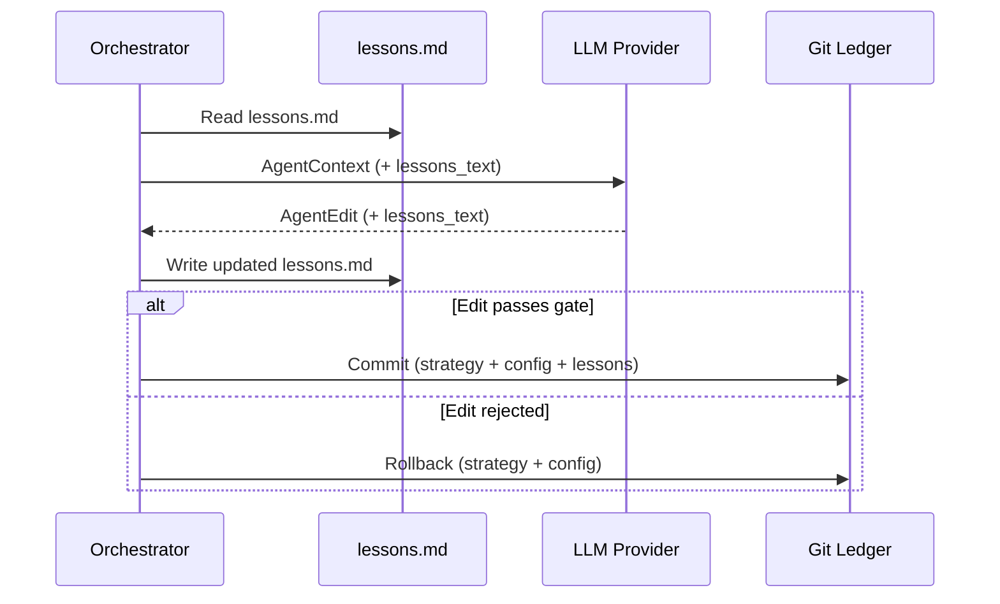

# 🚀 AutoBacktest

AutoBacktest is a state-of-the-art, **autonomous, AI-driven quantitative trading strategy optimization system**. It links large language model (LLM) agents with deterministic backtesting and statistical evaluation pipelines to iteratively refine and validate quantitative trading strategies completely unattended.

By combining an LLM optimizer, a vectorized backtester, a sacred Out-Of-Sample (OOS) holdout gate, and a git-backed ledger, AutoBacktest ensures that every strategy modification is statistically valid, robust against regime shifts, and protected from backtest overfitting via Deflated Sharpe Ratio (DSR) metrics.

---

## 📖 Architecture Overview



---

## ⚡ 15-Minute Quickstart

Follow these simple steps to go from a clean clone to your first autonomous LLM-driven strategy improvement in under 15 minutes.

### 1. Prerequisites
- **Python**: version `3.12` or `3.13`
- **uv**: high-performance dependency manager (Install via `curl -LsSf https://astral.sh/uv/install.sh | sh`)
- **Git**: installed and configured locally (`git config --global user.name "Your Name"`)
- **API Key**: an API key for your chosen LLM provider (e.g., OpenAI, Anthropic, or Google Gemini)

### 2. Setup
Clone the repository and sync the virtual environment using `uv`:
```bash
git clone <repository_url> autobacktest
cd autobacktest
uv sync
uv run pre-commit install
```

### 3. Environment Configuration
Copy the environment variables template and configure your API keys and custom configuration settings:
```bash
cp .env.dist .env
```
Open `.env` in a text editor to set your `OPENAI_API_KEY`, `ANTHROPIC_API_KEY`, or custom models and backtesting dates. Fallbacks and defaults are fully managed via the centralized configuration system in `.env`.

### 4. Run the Optimization Loop
Trigger the optimization loop on the reference **HAA (Hybrid Asset Allocation)** strategy for `5` iterations:
```bash
uv run autobacktest run \
  --program program.md \
  --strategy haa \
  --iterations 5 \
  --provider openai \
  --model gpt-4o
```
*What happens now?*
1. AutoBacktest sets up a git branch `autobacktest/haa-<timestamp>`.
2. It evaluates the baseline HAA strategy on walk-forward and holdout datasets.
3. The LLM processes the objective (`program.md`), current code, config, and performance metrics alongside historical lessons (`lessons.md`).
4. The LLM returns a structured edit including updated code, YAML config parameters, and refined lessons.
5. If the candidate code passes AST validation and beats the incumbent strategy in the statistical gate, it is committed to git. Otherwise, it is rolled back.

### 5. View Leaderboard Report
Print a gorgeous performance table summarizing the best accepted strategy variants directly from the SQLite ledger:
```bash
uv run autobacktest report
```

### 6. Reset strategy back to baseline
Reset the workspace back to `main` and wipe local optimization caches when you want to start fresh:
```bash
uv run autobacktest reset --strategy haa
```

---

## 🛠️ CLI Subcommand Details

AutoBacktest provides a simple, structured CLI interface via `typer`:

### `run`
Starts the autonomous optimization loop.
- `--program` / `-p`: Path to the markdown program objective file (e.g. `program.md`). [Required]
- `--strategy` / `-s`: The name of the target strategy in `strategies/`. [Required]
- `--iterations` / `-i`: Total optimization runs (default: `5`).
- `--provider`: LiteLLM provider name (e.g. `openai`, `anthropic`, `google`).
- `--model`: LLM model identifier (e.g. `gpt-4o`, `claude-3-5-sonnet-20241022`).
- `--run-dir`: Output run directory (default: `runs/`).
- `--target-metric`: Target metric for optimization: `sharpe` (default), `sortino`, or `information_ratio`.

### `report`
Pretty-prints the run leaderboard sorted by observed Sharpe ratio.
- `--run-dir`: Path to the runs directory containing `ledger.db` (default: `runs/`).
- `--strategy` / `-s`: Filter the leaderboard to a single strategy name.
- `--compare-all`: Show all strategies registered in the ledger side-by-side.

### `reset`
Cleans the working directories and baseline files.
- `--strategy` / `-s`: Scope the reset to one strategy (default: resets all).
- `--run-dir`: Path to the run directory to be completely deleted (default: `runs/`).
- *Restores `lessons.md` to its empty template and resets target strategy files back to `main` HEAD.*

### `evaluate`
Runs walk-forward and holdout evaluation on a single strategy file standalone.
- `--strategy` / `-s`: Path to the target strategy file (e.g. `strategies/haa.py`).
- `--start-date` / `--end-date`: Configure custom historical backtest backdrops.

---

## 🧠 Lessons Memory System (`lessons.md`)

AutoBacktest implements an **autonomous, self-curating memory system** for LLMs stored in `lessons.md` at the project root.
- The LLM updates the `lessons_text` field in every iteration to record what modifications worked, what failed, and key market insights discovered.
- **Token Budget**: The orchestrator tracks a `4096` token limit (~16,000 characters) using a character-based proxy.
- If lessons exceed the cap, a warnings alert triggers in the prompt, prompting the agent to **compress, consolidate, and prune** older findings.
- This creates a tight, self-curated, semantic memory loop that improves strategy results across hundreds of iterations.

---

## 🧪 Testing & Verification

Contributors can run the local quality and correctness verification suite to ensure all gates, validators, and evaluators are operating as specified:

```bash
uv run pytest
uv run ruff check .
uv run mypy --strict src/
```

Detailed developer guides, API specifications, and architectural deep-dives can be found in the [docs/](docs) directory:
- [Architecture & Design Details](docs/architecture.md)
- [API Reference Guide](docs/api-reference.md)
- [Developer Setup Instructions](docs/developer-setup.md)
- [About Project & Methodology](docs/about-project.md)

---

## ⚠️ Caveats & Constraints

AutoBacktest is a powerful R&D tool, but quantitative research carries fundamental risks. Please review the following caveats carefully:

1. **yfinance Data Quality**: AutoBacktest uses Yahoo Finance data for quick bootstrapping. Yahoo Finance data is subject to corporate action adjustments, dividend timing variations, survivorship bias (delisted stocks are omitted from past universes), and occasional missing/noisy bars. Do not deploy strategies live without verifying returns against professional data feeds.
2. **Backtest Overfitting**: Generating thousands of strategy variations naturally leads to selection bias. While AutoBacktest uses walk-forward testing and Deflated Sharpe Ratio (DSR) to account for multiple testing, extreme iteration counts on small datasets will eventually overfit.
3. **No Live Trading Support**: The output of AutoBacktest is a git-tracked code file and a performance report. It does **NOT** place trades, generate live brokerage API signals, or support real-time execution. It is purely a backtesting research platform.
4. **LLM API Costs**: The optimization loop performs structured completions on large strategy code files. A 50-iteration run on high-end models (such as GPT-4o or Claude 3.5 Sonnet) can cost $2.00 to $5.00 in API tokens. Set your iterations carefully.
5. **Time Horizon**: AutoBacktest is tailored for daily/monthly portfolio rebalancing strategies (e.g., Tactical Asset Allocation). Vectorized execution under monthly constraints is robust, but high-frequency or intraday execution is completely unsupported in v1.
