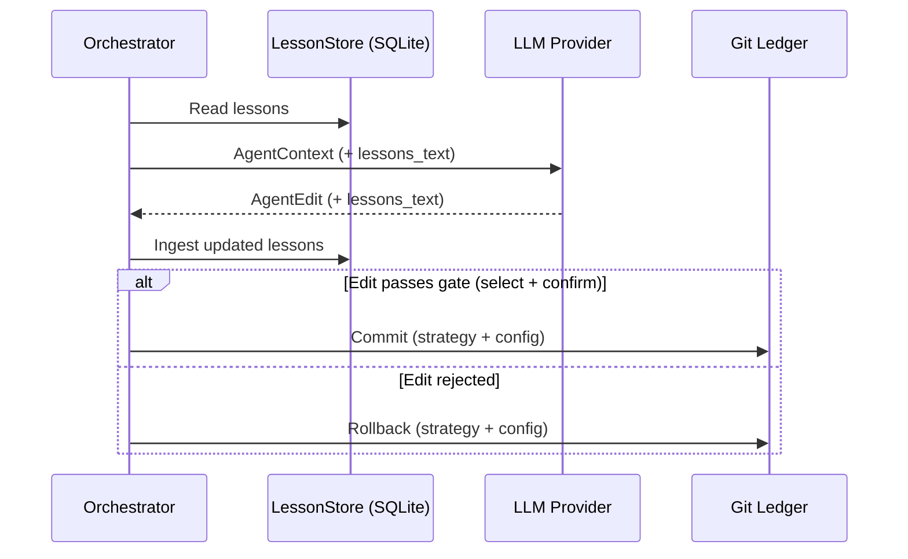

# AutoBacktest

[](https://github.com/LeFi8/autobacktest/actions/workflows/ci.yml)
[](LICENSE)
[](pyproject.toml)
[](https://github.com/astral-sh/ruff)

**Autonomous, AI-driven quantitative trading strategy optimization.** AutoBacktest
links LLM agents with deterministic backtesting and statistical validation to
iteratively refine trading strategies — completely unattended.

LLM → code edit → preflight check → backtest → gate → commit or rollback

---

## Quickstart

### 1. Prerequisites

- **Python 3.12+**
- **uv** — install: `curl -LsSf https://astral.sh/uv/install.sh | sh`
- **Git**
- **API key** — for an LLM provider (OpenAI, Anthropic, Google Gemini, etc.)

### 2. Setup

```bash
git clone https://github.com/LeFi8/autobacktest.git
cd autobacktest
uv sync
cp .env.dist .env
```

Edit `.env` to set your API key and any backtest date windows.

### 3. Run the optimization loop

```bash
uv run autobacktest run \
  --program program.md \
  --strategy haa \
  --iterations 5
```

This evaluates the baseline strategy, generates candidate mutations via an LLM,
validates them through a multi-stage gate (preflight, backtest, diversity, drawdown,
DSR), and commits improvements to git.

### 4. View results

```bash
uv run autobacktest report
```

Full visual reports, equity curves, and strategy summaries land in `runs/<run_id>/`.

---

## Creating your own strategy

Each strategy has two files matching by name stem:

| File | Purpose |
|---|---|
| `strategies/<name>.py` | Signal generation — exports `generate_signals(prices, config)` |
| `configs/<name>.yaml` | Parameters — universe, limits, Pydantic-validated fields |

**Scaffold a new strategy:**

```bash
uv run autobacktest init-strategy --name my_strategy
```

This generates boilerplate code and a validated YAML config with guided prompts.

**Write your program:**

Edit `program.md` (the LLM's objective + constraints). See `program.md` for the
template — fill in your goal, constraints, and any strategy background.

To keep multiple program specs without tracking them in git, copy `program.md`
to `program-<name>.md` — files matching `program-*.md` are git-ignored by default.

**Run it:**

```bash
uv run autobacktest run --program program.md --strategy my_strategy --iterations 10
```

See `strategies/haa.py` and `configs/haa.yaml` for a complete reference strategy
(Hybrid Asset Allocation by Keller & Keuning).

---

## How it works



1. Read the program spec (objective + constraints) and past lessons.
2. The LLM generates **N candidate mutations** in parallel — code edits, YAML changes, refined lessons.
3. Each candidate runs **preflight validation**: import whitelist, AST checks, Pydantic config, smoke test.
4. **Config similarity gate** filters duplicate parameter proposals (Tier 1).
5. **Backtesting**: walk-forward (in-sample) + holdout (out-of-sample) evaluation.
6. **Returns correlation gate** filters functionally identical variants (Tier 2).
7. **Two-phase gate**: `select` (in-sample metrics, DSR non-degradation) → `confirm` (holdout confirmation).
8. Passed candidates are **committed to git**; failures are rolled back with structured feedback.

---

## CLI Reference

| Command | Description |
|---|---|
| `run` | Autonomous optimization loop |
| `report` | Print leaderboard from SQLite ledger |
| `reset` | Reset strategy to baseline, wipe caches |
| `evaluate` | Run walk-forward + holdout on a single strategy |
| `init-strategy` | Scaffold a new strategy with validated config |
| `llm-test` | Test an LLM edit against preflight checks |
| `spa` | Hansen's Superior Predictive Ability audit |

Use `uv run autobacktest --help` for full flag details.

---

## Testing & quality

```bash
uv run pytest          # 395+ tests
uv run ruff check .    # linting (line-length 120, target py312)
uv run mypy src/       # strict type checking
```

---

## Project structure

```
autobacktest/
├── strategies/         # Signal code (<name>.py + <name>.yaml)
├── configs/            # Parameters per strategy
├── src/autobacktest/   # Core engine
│   ├── cli.py          # Typer entrypoint
│   ├── commands/       # Subcommand implementations (run, report, evaluate, etc.)
│   ├── orchestrator.py # Optimization loop orchestration
│   ├── optimization/   # Candidate generation, eval mgmt, persistence
│   ├── gate.py         # Two-phase (select + confirm)
│   ├── evaluator/      # Backtest, engine, metrics, CSCV/PBO, DSR, regime
│   ├── strategy/       # Validator, AST linter, sandbox, codemod, diversity
│   └── data/           # Price data, caching
├── docs/               # Architecture, API reference, setup guides
├── runs/               # Run artifacts (git-ignored)
├── program.md          # LLM objective + constraints template
├── lessons.md          # Auto-curated LLM memory
└── .env.dist           # Environment template
```

---

## Caveats

- **yfinance data quality**: corporate actions, dividend timing, survivorship bias.
  Verify against professional data feeds before deploying live.
- **Backtest overfitting**: walk-forward + DSR mitigate this, but extreme iteration
  counts on small datasets will overfit.
- **No live trading**: this is a research platform — no brokerage connectivity.
- **LLM costs**: ~$2–$5 per 50 iterations on GPT-4o / Claude 3.5 Sonnet.
- **Monthly rebalancing only**: intraday / HFT is unsupported.
