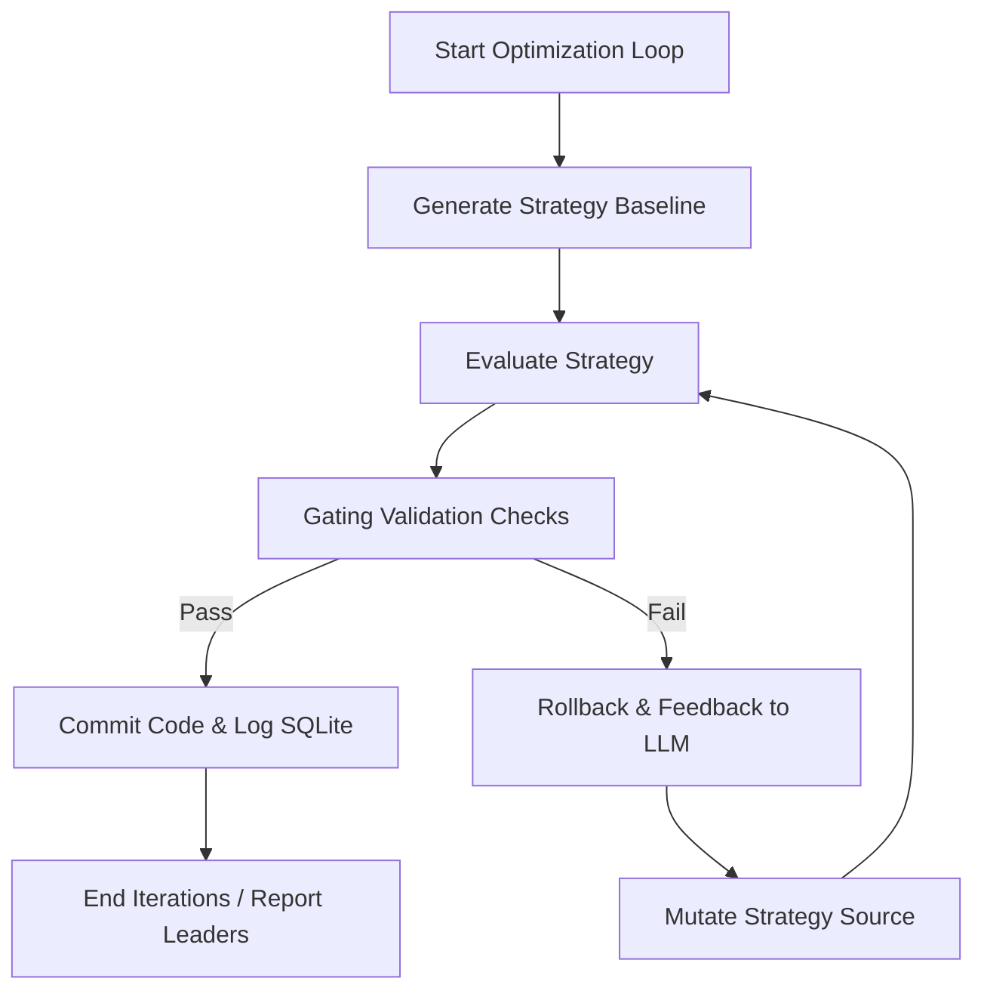

# About AutoBacktest

AutoBacktest is an autonomous, AI-driven quantitative trading strategy optimization system. It connects large language model (LLM) agents with deterministic backtesting and statistical evaluation pipelines to iteratively refine and validate quant trading strategies without human intervention.

## Business Goal
Automate the design, evaluation, and tuning of quant strategies. By pairing LLM reasoning with mathematical validation (DSR, bootstrapping, stress testing, transaction costs), the platform establishes a self-correcting strategy development loop that prevents overfitting and guarantees statistical significance before deploying strategy iterations.

## Target User Persona
- **Quantitative Researchers & Developers**: Who want to automate parameter searching and signal engineering.
- **Algotraders & Fund Managers**: Seeking a self-documenting, risk-mitigating pipeline for strategy lifecycle tracking.
- **Autonomous AI Agents**: Systems designed to run non-interactive loops optimizing performance metrics under target risk criteria.

## Primary Interaction Flows

### Detailed Flow Steps
1. **Initiate Loop**: User defines constraints (e.g. max drawdown limit, maximum turnover, benchmark) in a configuration file and target strategy (`strategies/haa.py`).
2. **Pre-Flight Verification**:
   - Executes structural and security checks (AST whitelist, weight-shape correctness, static validations).
3. **Tier 1 Diversity Gate (Config Similarity)**:
   - Compares the candidate's proposed configuration fingerprint with all historical configs in this dataset universe using min-max normalized parameters.
   - If the similarity exceeds `DIVERSITY_CONFIG_THRESHOLD = 0.95`, the orchestrator rejects the proposal and triggers a bounded retry (up to 2 times per iteration) requesting a more diverse parameter combination.
4. **Deterministic Evaluation**:
   - Fetches historical prices from cache or online (Yahoo Finance).
   - Generates daily signal weights from the active strategy file.
   - Runs a vectorized daily return computation (shifted by 1 day to prevent lookahead-bias).
   - Penalizes returns using dynamic rebalancing turnover costs, commission rates, bid-ask spreads, and market impact models.
5. **Tier 2 Diversity Gate (Returns Correlation)**:
   - Measures the Pearson correlation coefficient between the candidate's daily net returns and those of all previously recorded attempts in the SQLite ledger.
   - Rejects the candidate if its return profile is too highly correlated (`> DIVERSITY_RETURNS_THRESHOLD = 0.90`) with any past attempt, preventing the LLM from proposing functionally duplicate strategy modifications.
6. **Statistical Validation Check (Improvement Gates)**:
   - Partitions data into In-Sample (walk-forward rolling windows) and Out-of-Sample (last 3 years holdout) segments.
   - Audits performance over major stress regimes (e.g., Dot-Com bubble, 2008 Financial Crisis, 2020 Covid Crash).
   - Computes **Deflated Sharpe Ratio (DSR)** adjusting for multiple trials and correlation structure to monitor data-snooping risk.
   - Conducts a **Stationary Block Bootstrap** (Monte Carlo, 1000 paths) on historical returns to calculate significance thresholds.
7. **Ledger Commit / Rollback**:
   - Evaluates lexicographic gates sequence: Max Drawdown Holdout Limit, Stress Regimes, and Holdout Rebalancing Turnover.
   - Performs a final tie-breaker requiring a minimum improvement epsilon over the current incumbent's target metric (Sharpe, Sortino, or Information Ratio).
   - If all gate criteria are met, the orchestrator commits the updated files to Git and registers the performance metrics, parameters, and net returns in the SQLite ledger database. Otherwise, it rolls back strategy changes and sends diagnostic feedback to the LLM agent.

