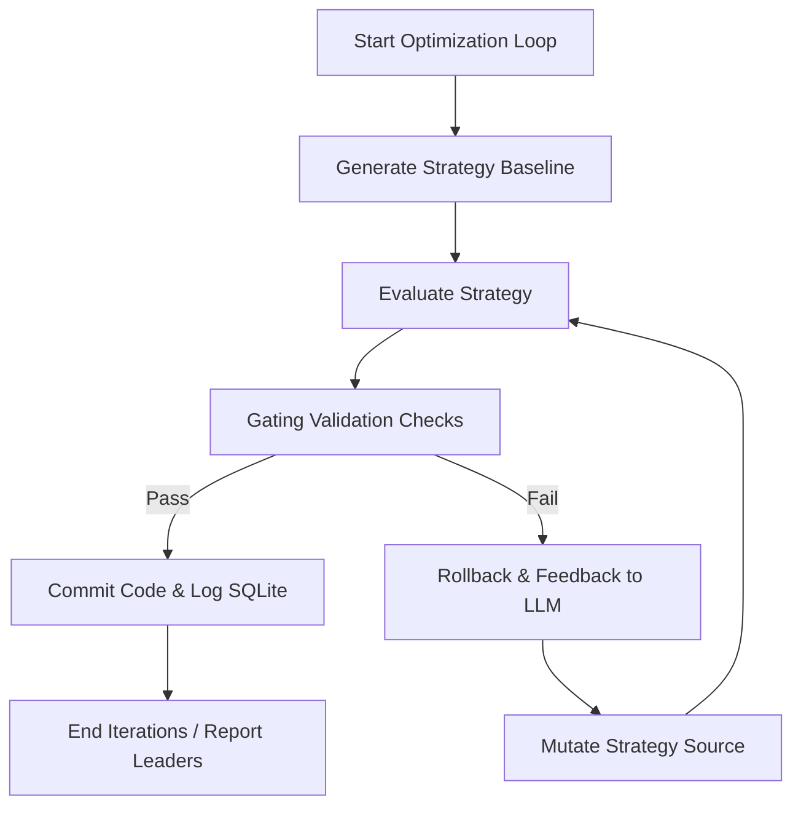

# About AutoBacktest

AutoBacktest is an autonomous, AI-driven quantitative trading strategy optimization system. It connects large language model (LLM) agents with deterministic backtesting and statistical evaluation pipelines to iteratively refine and validate quant trading strategies without human intervention.

## Business Goal
Automate the design, evaluation, and tuning of quant strategies. By pairing LLM reasoning with mathematical validation (DSR, bootstrapping, stress testing, transaction costs), the platform establishes a self-correcting strategy development loop that prevents overfitting and guarantees statistical significance before deploying strategy iterations.

## Target User Persona
- **Quantitative Researchers & Developers**: Who want to automate parameter searching and signal engineering.
- **Algotraders & Fund Managers**: Seeking a self-documenting, risk-mitigating pipeline for strategy lifecycle tracking.
- **Autonomous AI Agents**: Systems designed to run non-interactive loops optimizing performance metrics under target risk criteria.

## Primary Interaction Flows

### Detailed Flow Steps
1. **Initiate Loop**: User defines constraints (e.g. max drawdown limit, maximum turnover, benchmark) in a configuration file and target strategy (`strategies/haa.py`).
2. **Deterministic Evaluation**:
   - Fetches historical prices from cache or online (Yahoo Finance).
   - Generates daily signal weights from the active strategy file.
   - Vectorizes returns factoring bid-ask spreads and dynamic rebalancing turnover costs.
3. **Statistical Validation Check (Improvement Gates)**:
   - Partition data into In-Sample (walk-forward rolling windows) and Out-of-Sample (last 3 years holdout).
   - Computes **Deflated Sharpe Ratio (DSR)** to account for multiple testing bias and data snooping.
   - Conducts a **Stationary Block Bootstrap** (Monte Carlo) to evaluate return significance.
   - Audits performance over major stress regimes (e.g. 2008 Crash, 2020 Covid Crisis).
4. **Ledger Commit / Rollback**:
   - If all gate thresholds are satisfied, the system updates the strategy SQLite ledger tracking table and commits the modified code to Git.
   - If any gate fails, the change is reverted, and details of the failure are fed back to the LLM agent for the next iteration.

Generated: 2026-05-25
