# System Architecture

AutoBacktest decouples strategy creation (generative AI) from evaluation (deterministic mathematical verification). This ensures that any strategy modifications made by the AI are mathematically validated before being saved.

## Structural Layout & Module Dependencies

```mermaid
graph TD
    subgraph CLI / Interface
        CLI[cli.py]
    end

    subgraph Core Orchestration
        ORCH[orchestrator.py]
        GATE[gate.py]
        PROG[program.py]
    end

    subgraph Strategy & Config Validation
        SCHEM[strategy/config_schema.py]
        VAL[strategy/validator.py]
        CONT[strategy/contract.py]
        DIV[strategy/diversity.py]
        NORM[strategy/normalization.py]
        PI[strategy/parameter_importance.py]
    end

    subgraph Evaluation Pipeline
        EVAL[evaluator/evaluate.py]
        BACK[evaluator/backtest.py]
        COST[evaluator/costs.py]
        DSR[evaluator/deflated_sharpe.py]
        BOOT[evaluator/monte_carlo.py]
        REG[evaluator/regime.py]
        SPLIT[evaluator/holdout.py]
        WF[evaluator/walk_forward.py]
    end

    subgraph Reporting Layer
        REP[reports/generator.py]
    end

    subgraph Data Layer
        CACHE[data/cache.py]
        YF[data/yfinance_provider.py]
    end

    subgraph Lessons Layer
        LESS[lessons/store.py]
    end

    subgraph LLM Layer
        LLM_B[llm/base.py]
        LLM_P[llm/prompts.py]
        LLM_L[llm/litellm_provider.py]
        LLM_M[llm/mock_provider.py]
    end

    subgraph Ledger Layer
        LEDG[ledger/store.py & git_ops.py]
        EVLOG[ledger/event_log.py]
    end

    subgraph Strategies
        STRAT[strategies/*.py]
    end

    CLI --> ORCH
    CLI --> REP
    ORCH --> EVAL
    ORCH --> GATE
    ORCH --> LEDG
    ORCH --> PROG
    ORCH --> SCHEM
    ORCH --> DIV
    ORCH --> VAL
    ORCH --> LESS
    ORCH --> LLM_B
    ORCH --> PI
    VAL --> CONT
    EVAL --> BACK
    EVAL --> COST
    EVAL --> DSR
    EVAL --> BOOT
    EVAL --> REG
    EVAL --> SPLIT
    EVAL --> WF
    EVAL --> CACHE
    EVAL --> NORM
    CACHE --> YF
    STRAT --> EVAL
    LLM_L --> LLM_B
    LLM_M --> LLM_B
```



## Module Definitions

### 1. Command-Line Interface (`cli.py`)
Provides user subcommands utilizing `typer` and formats leaderboard responses via `rich`.
- `run`: Executes the iterative LLM optimization loop. Supports rendering a side-by-side Rich console summary comparison of baseline vs. optimized metrics, or falling back to raw JSON printout using the `--json` option.
- `report`: Displays runs leaderboard from SQLite tracking ledger.
- `reset`: Reverts strategy codes to baseline states and purges run logs.
- `evaluate`: Evaluates a standalone strategy directly without the optimization loop.
- `init-strategy`: Interactive wizard that scaffolds a new strategy. Prompts for universe, benchmark, risk limits, and custom parameters, validates via `StrategyConfig`, and generates `configs/{name}.yaml` and `strategies/{name}.py` boilerplate.

### 2. LLM Driver (`llm/`)
Provides the abstract contract and concrete implementations for LLM-powered strategy mutation.
- `base.py`: Defines `LLMProvider` (abstract base), `AgentContext` (immutable input dataclass), `AgentEdit` (structured mutation output), and `LLMError` (domain exception).
- `prompts.py`: System prompt templates and structured output schema definitions.
- `litellm_provider.py`: LiteLLM-based implementation supporting OpenAI, Anthropic, Google, and other providers via tool calling.
- `mock_provider.py`: Deterministic mock provider returning fixed edits for offline testing.

### 3. Lessons Memory (`lessons/`)
Structured, deduplicated memory store replacing the flat `lessons.md` file.
- `store.py`: `LessonStore` — SQLite-backed persistence with per-strategy filtering, deduplication by `(strategy, type, body_hash)`, and markdown import/export. Migrates legacy `lessons.md` on first use.

### 4. Data Provider (`data/`)
Provides historical close price histories with Parquet caching.

### 5. Backtest Evaluator (`evaluator/`)
Consumes prices and strategy signals to compute detailed performance metrics.
- `report.py`: Defines `EvaluationReport` and `WindowReport` dataclasses for structured performance output.
- `evaluate.py`: Coordinates the full walk-forward / holdout evaluation lifecycle (`evaluate_strategy`, `evaluate_strategy_detailed`).

### 7. Git & SQLite Ledger (`ledger/`)
- `store.py`: Relational database storing every iteration's parameters, Sharpe, Sortino, max drawdown, gating outcomes, and serialized return streams.
- `git_ops.py`: Commits valid strategy code changes. Reverts failures back to last known passing revision automatically.
- `event_log.py`: Manages the structured JSON events logging history.

### 8. Reporting Module (`reports/`)
- `generator.py`: Produces equity curve plots (`plot_equity_curves`), failure summaries (`compile_failure_summary`), and institutional-grade strategy reports (`compile_strategy_report`).

### 6. Strategy Validation & Registry (`strategy/`)
Enforces code correctness, type-safety, and logic uniqueness constraints on candidate mutations.
- `config_schema.py`: Pydantic v2 strategy configuration validation model (`StrategyConfig`). Enforces parameter boundaries, types, and flattens custom parameters in `params` avoiding root schema collisions.
- `contract.py`: Dynamic weight and signature correctness validators. Verifies shape conformity, asset indexes, and time series offsets.
- `validator.py`: Safe code pre-flight runner. Includes AST parsing for imports whitelisting, isolated compile execution, and sub-window lookahead testing on synthetic price curves.
- `diversity.py`: Quantitative diversity analyzer. Extracts configuration fingerprints and computes cosine similarity of parameters or Pearson correlation of backtest returns.
- `normalization.py`: Code normalization utility (`normalize_python_code`) that strips comments/docstrings and standardizes whitespace for stable eval cache key computation.
- `parameter_importance.py`: Computes Spearman rank correlation between numeric config parameters and the target metric across optimization attempts to identify which parameters most strongly influence performance.

---

## 🔁 Core Orchestration & Diversity Loop Flow

The Orchestrator coordinates the recursive LLM strategy mutation process under several layers of strict protection gates to ensure only robust, unique, and compile-safe models are accepted.

```mermaid
graph TD
    A[Start Iteration] --> B[Generate 3 Candidates in Parallel]
    B --> C[Pre-Flight Verification]
    C -- Fail --> D[Revert & Record Failure]
    C -- Pass --> E[Tier 1 Config Similarity *]
    E -- Fail → Retry --> B
    E -- Pass --> F[Vectorized Backtest Engine]
    F --> G[Tier 2 Returns Correlation *]
    G -- Fail --> D
    G -- Pass --> H[select Gate (in-sample)]
    H -- Fail --> D
    H -- Pass --> I[confirm Gate (holdout)]
    I -- Fail --> D
    I -- Pass --> J[Git Commit & Update Incumbent]
    J --> K[Iteration Loop Complete]
    * — only active in EXPLORE mode
```

### 1. Pre-Flight Protection Gate
Every LLM-generated code/config edit is validated via **6 checks** in a sandboxed subprocess before executing on real financial datasets:
- **Path Traversal Security**: Verifies no path escape attacks in strategy/config file names.
- **AST Scan**: Prevents importing arbitrary third-party modules or subprocessing. Only `pandas`, `numpy`, `math`, `typing`, `scipy`, `dataclasses`, `collections`, `itertools`, `functools`, `decimal`, `statistics`, `numbers`, `json` are whitelisted. Also blocks dangerous I/O operations (`open`, `exec`, `eval`, `compile`, pandas I/O methods).
- **Pydantic Config Validation**: Validates YAML against the `StrategyConfig` Pydantic schema before execution.
- **Dynamic Compilation & Import**: Runs within isolated execution blocks to catch standard syntax and runtime errors.
- **Smoke Test**: Generates synthetic prices and verifies the strategy executes without errors.
- **Sub-Window Stability & Lookahead Sniffing**: Evaluates on synthetic prices with a shifted offset to guarantee future values are not leaked during calculations.

### 2. Tier 1 - Config Similarity Gate (Pre-Backtest)
To prevent the LLM from executing identical parameter configurations repeatedly, the orchestrator parses candidates into normalized fingerprints:
- Numeric variables are mapped to a $[0, 1]$ scale using `KNOWN_RANGES` or bounds of the observed history.
- Structured collections (such as ticker sets) are computed via Jaccard indices.
- Config similarity is measured as `0.7 x cosine(numeric) + 0.3 x mean(Jaccard of sets)`.
- If similarity to any previously attempted configuration exceeds `DIVERSITY_CONFIG_THRESHOLD = 0.95`, the orchestrator rejects the attempt immediately.
- It triggers a bounded **retry loop (up to 2 retries)** inside the same iteration. If all 2 retries fail config diversity, the iteration is skipped to preserve computation budget.

### 3. Tier 2 - Returns Correlation Gate (Post-Backtest)
Even if configuration parameters look structurally different, a modified strategy might generate identical signal returns. Post-backtest:
- The system calculates the Pearson correlation coefficient between the daily net returns of the candidate and all past attempts tracked in this dataset universe.
- If the correlation coefficient with any past attempt exceeds `DIVERSITY_RETURNS_THRESHOLD = 0.90`, the candidate is rejected (`rejection_reason="diversity_tier2_returns"`), rolled back, and recorded in the database.

### 4. Two-Phase Gate System (In-Sample Selection + Holdout Confirmation)
The gate system is split into two distinct phases to prevent holdout overfitting:

**Phase 1 — `select` (in-sample, every candidate):**
- Hard constraints on the walk-forward aggregate: max drawdown ≤ `dd_limit` (default `0.20`), `regime_passed` must be `True`, turnover ≤ `turnover_limit` (default `2.0`).
- Tie-breaker: target metric improvement over baseline (Sharpe, Sortino, or Information Ratio) by at least `min_improvement`.
- DSR non-degradation check (always-on by default, configurable): candidate's in-sample DSR must not degrade below the baseline's.
- The holdout is **never consulted** at this stage.

**Phase 2 — `confirm` (holdout, budgeted peeks):**
- Only reached when `select` passes.
- Hard constraints on the holdout: max drawdown ≤ `dd_limit`, turnover ≤ `turnover_limit`.
- Holdout DSR non-degradation against the baseline.
- Each successful `confirm` call consumes one **holdout peek** (default budget: `20`). Once exhausted, the optimization loop terminates early to preserve the integrity of the OOS estimate.

The legacy `accept()` function composes `select` + `confirm` as a single call for the standalone evaluation path.

### 5. Multi-Candidate Parallel Generation
Each iteration produces **3 candidate edits in parallel** via a `ThreadPoolExecutor`:
- The LLM is called concurrently with the same `AgentContext`.
- Candidates that fail preflight validation are discarded immediately.
- Valid candidates proceed through the full diversity, evaluation, and gate pipeline.
- The best surviving candidate (highest target metric) is committed; all others are recorded as failed attempts in the ledger.

An **eval cache** (`_eval_cache`, keyed by `hash(normalized_code, sorted_config_json)`) skips redundant evaluations when the same edit is proposed a second time in the same run.

### 6. Explore / Exploit Mode & Dynamic Temperature
The orchestrator uses a dual-mode system to balance broad search with focused refinement:

**Explore mode** (default): Diversity gates are active. Temperature scales dynamically based on the rolling failure rate over the last 5 iterations. High failure rate → higher temperature for more creative exploration.

**Exploit mode**: Activated after any successful commit. Diversity gates are suspended. Temperature is fixed at `0.1` for focused local refinement. If `EXPLOIT_PATIENCE = 3` consecutive iterations pass without improvement, the system reverts to explore mode.

**Stuck Escalation**: If `STUCK_THRESHOLD = 5` consecutive iterations pass without **any** acceptance (regardless of mode), the mode is forced to `"explore"` and temperature is escalated toward `start_temp` via the rolling failure rate mechanism.

### 7. Early Stopping Patience
If no strategy iteration passes all gates for `EARLY_STOP_PATIENCE` consecutive attempts (default `10`, configurable via `AUTOBACKTEST_EARLY_STOP_PATIENCE` env var or `--early-stop-patience` CLI flag), the orchestrator halts optimization early, preserving API credits. Set to `0` to disable early stopping entirely.

### 8. Parameter Importance Tracking
After each iteration, the orchestrator computes Spearman rank correlations between numeric config parameters and the target metric across all historical attempts in the current dataset universe. Parameters with statistically significant rank correlations are recorded as lessons, helping the LLM focus on high-impact parameters in future iterations.


