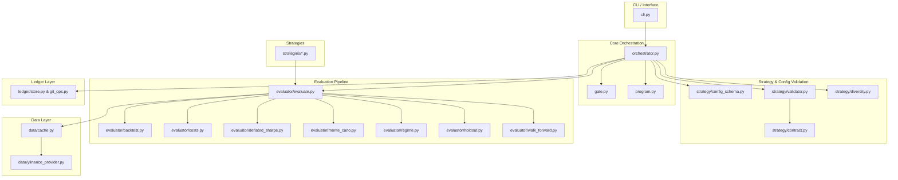
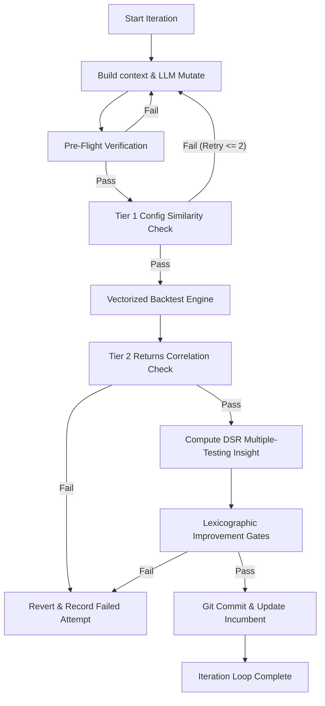

# System Architecture

AutoBacktest decouples strategy creation (generative AI) from evaluation (deterministic mathematical verification). This ensures that any strategy modifications made by the AI are mathematically validated before being saved.

## Structural Layout & Module Dependencies

## Module Definitions

### 1. Command-Line Interface (`cli.py`)
Provides user subcommands utilizing `typer` and formats leaderboard responses via `rich`.
- `run`: Executes the iterative LLM optimization loop.
- `report`: Displays runs leaderboard from SQLite tracking ledger.
- `reset`: Reverts strategy codes to baseline states and purges run logs.
- `evaluate`: Evaluates a standalone strategy directly without the optimization loop.

### 2. Data Provider (`data/`)
Fetches and caches market close prices in Apache Parquet files.
- `yfinance_provider.py`: Communicates with Yahoo Finance using `yfinance` to download prices.
- `cache.py`: Intercepts calls, managing prepending/appending incremental date ranges locally to avoid redundant API downloads.

### 3. Backtest Evaluator (`evaluator/`)
Consumes daily price data and strategy allocation weights to compute risk/return metrics.
- `backtest.py`: Fast vectorized backtest holding weights for $t$ based on close of $t-1$ (prevents lookahead-bias).
- `costs.py`: Applies turnover penalties (e.g. bid-ask spreads, commissions) on weight rebalancing changes.
- `deflated_sharpe.py`: Computes the Deflated Sharpe Ratio (DSR) to calculate statistical confidence while adjusting for multiple trials.
- `monte_carlo.py`: Runs a stationary block bootstrap (1000 paths) on historical returns to calculate significance thresholds.
- `regime.py`: Checks maximum drawdowns over historical stress periods (e.g. dot-com crash, 2008 crisis, 2020 covid crash).

### 4. Git & SQLite Ledger (`ledger/`)
Tracks strategy iterations.
- `store.py`: Relational database storing every iteration's parameters, Sharpe, Sortino, max drawdown, and gating outcomes.
- `git_ops.py`: Commits valid strategy code changes. Reverts failures back to last known passing revision automatically.
- `event_log.py`: Manages the structured JSON events logging history.

### 5. Strategy Validation & Registry (`strategy/`)
Enforces code correctness, type-safety, and logic uniqueness constraints on candidate mutations.
- `config_schema.py`: Pydantic v2 strategy configuration validation model (`StrategyConfig`). Enforces parameter boundaries, types, and flattens custom parameters in `params` avoiding root schema collisions.
- `contract.py`: Dynamic weight and signature correctness validators. Verifies shape conformity, asset indexes, and time series offsets.
- `validator.py`: Safe code pre-flight runner. Includes AST parsing for imports whitelisting, isolated compile execution, and sub-window lookahead testing on synthetic price curves.
- `diversity.py`: Quantitative diversity analyzer. Extracts configuration fingerprints and computes cosine similarity of parameters or Pearson correlation of backtest returns.

---

## 🔁 Core Orchestration & Diversity Loop Flow

The Orchestrator coordinates the recursive LLM strategy mutation process under several layers of strict protection gates to ensure only robust, unique, and compile-safe models are accepted.

### 1. Pre-Flight Protection Gate
Every LLM-generated code/config edit is validation-tested before executing on real financial datasets:
- **AST Scan**: Prevents importing arbitrary third-party modules or subprocessing. Only standard math libraries, `pandas`, `numpy`, and certified quantitative submodules are whitelisted.
- **Dynamic Compilation**: Runs within isolated execution blocks to catch standard syntax errors.
- **Contract Verification**: Validates that weights are computed in a aligned format matching asset universes exactly, summing to $\le 1.0$ (no leverage), with no `NaN` outputs.
- **Lookahead Bias Sniffer**: Evaluates on synthetic prices with an offset to guarantee future values are not leaked during calculations.

### 2. Tier 1 - Config Similarity Gate (Pre-Backtest)
To prevent the LLM from executing identical parameter configurations repeatedly, the orchestrator parses candidates into normalized fingerprints:
- Numeric variables are mapped to a $[0, 1]$ scale using `KNOWN_RANGES` or bounds of the observed history.
- Structured collections (such as ticker sets) are computed via Jaccard indices.
- Config similarity is measured as `0.7 x cosine(numeric) + 0.3 x mean(Jaccard of sets)`.
- If similarity to any previously attempted configuration exceeds `DIVERSITY_CONFIG_THRESHOLD = 0.95`, the orchestrator rejects the attempt immediately.
- It triggers a bounded **retry loop (up to 2 retries)** inside the same iteration. If all 2 retries fail config diversity, the iteration is skipped to preserve computation budget.

### 3. Tier 2 - Returns Correlation Gate (Post-Backtest)
Even if configuration parameters look structurally different, a modified strategy might generate identical signal returns. Post-backtest:
- The system calculates the Pearson correlation coefficient between the daily net returns of the candidate and all past attempts tracked in this dataset universe.
- If the correlation coefficient with any past attempt exceeds `DIVERSITY_RETURNS_THRESHOLD = 0.90`, the candidate is rejected (`rejection_reason="diversity_tier2_returns"`), rolled back, and recorded in the database.

### 4. Dynamic Temperature Tuning
To balance exploitation (tuning existing parameters) with exploration (finding new signals), the orchestrator dynamically adjusts the LLM generation temperature:
- **Linear Temperature Decay**: Temperature decays linearly from the user's `start_temp` down to `0.1` as the iterations approach completion.
- **Stuck Escalation**: If the orchestrator is "stuck" (runs for `STUCK_THRESHOLD = 5` consecutive iterations without finding an accepted strategy variant), it escalates temperature toward `start_temp` via a `STUCK_ESCALATION_FACTOR = 0.8` multiplier to force creative exploratory steps.

### 5. Early Stopping Patience
If no strategy iteration passes the validation, diversity, and lexicographic gate sequence for `EARLY_STOP_PATIENCE = 10` consecutive attempts, the orchestrator halts optimization early, preserving API credits.

