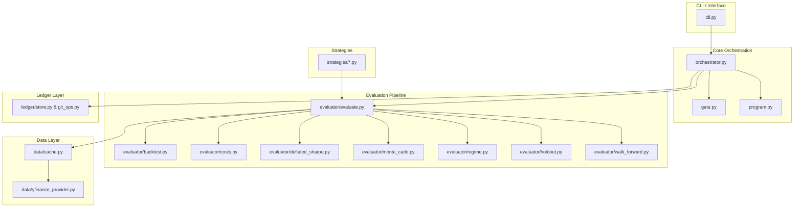

# System Architecture

AutoBacktest decouples strategy creation (generative AI) from evaluation (deterministic mathematical verification). This ensures that any strategy modifications made by the AI are mathematically validated before being saved.

## Structural Layout & Module Dependencies

## Module Definitions

### 1. Command-Line Interface (`cli.py`)
Provides user subcommands utilizing `typer` and formats leaderboard responses via `rich`.
- `run`: Executes the iterative LLM optimization loop.
- `report`: Displays runs leaderboard from SQLite tracking ledger.
- `reset`: Reverts strategy codes to baseline states and purges run logs.
- `evaluate`: Evaluates a standalone strategy directly without the optimization loop.

### 2. Data Provider (`data/`)
Fetches and caches market close prices in Apache Parquet files.
- `yfinance_provider.py`: Communicates with Yahoo Finance using `yfinance` to download prices.
- `cache.py`: Intercepts calls, managing prepending/appending incremental date ranges locally to avoid redundant API downloads.

### 3. Backtest Evaluator (`evaluator/`)
Consumes daily price data and strategy allocation weights to compute risk/return metrics.
- `backtest.py`: Fast vectorized backtest holding weights for $t$ based on close of $t-1$ (prevents lookahead-bias).
- `costs.py`: Applies turnover penalties (e.g. bid-ask spreads, commissions) on weight rebalancing changes.
- `deflated_sharpe.py`: Computes the Deflated Sharpe Ratio (DSR) to calculate statistical confidence while adjusting for multiple trials.
- `monte_carlo.py`: Runs a stationary block bootstrap (1000 paths) on historical returns to calculate significance thresholds.
- `regime.py`: Checks maximum drawdowns over historical stress periods (e.g. dot-com crash, 2008 crisis, 2020 covid crash).

### 4. Git & SQLite Ledger (`ledger/`)
Tracks strategy iterations.
- `store.py`: Relational database storing every iteration's parameters, Sharpe, Sortino, max drawdown, and gating outcomes.
- `git_ops.py`: Commits valid strategy code changes. Reverts failures back to last known passing revision automatically.
- `event_log.py`: Manages the structured JSON events logging history.

