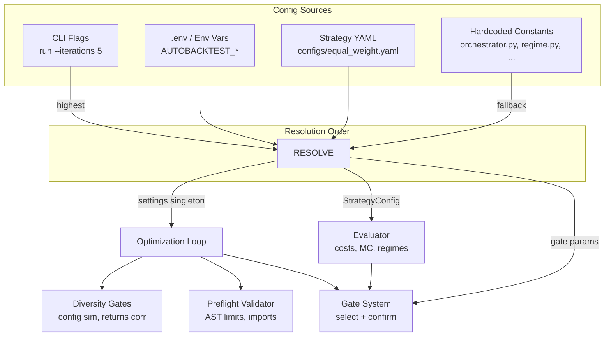

# Optimization Configuration Reference

This document catalogs every configurable parameter in the AutoBacktest optimization pipeline. Parameters are organised by source (CLI, environment, strategy YAML, hardcoded constants) and cross-referenced to the gate system they feed.

---

## 1. Configuration Sources & Resolution Order

Configuration is resolved from four sources, with the following priority (highest wins):

---

## 2. CLI Flags (`autobacktest run`)

| Flag | Type | Default | Description |
|---|---|---|---|
| `--program` / `-p` | `str` | _required_ | Path to program.md (objective + constraints) |
| `--strategy` / `-s` | `str` | _required_ | Strategy name (matches `strategies/<name>.py`) |
| `--iterations` / `-i` | `int` | `5` | Number of optimization iterations |
| `--provider` | `str` | `litellm` | LLM provider backend |
| `--model` | `str` | `deepseek/deepseek-v4-pro` | LLM model name |
| `--run-dir` | `str` | `runs` | Directory for run data (SQLite, events) |
| `--target-metric` | `str` | `sharpe` | Optimization objective: `sharpe`, `sortino`, or `information_ratio` |
| `--resume` | `str` | `None` | Run ID to resume (recovery path) |
| `--holdout-peek-limit` | `int` | `20` | Max holdout evaluations before early termination |
| `--early-stop-patience` | `int` | `10` | Consecutive rejections allowed; `0` to disable |
| `--json` | `bool` | `False` | Output raw JSON instead of Rich dashboard |
| `--quiet` / `-q` | `bool` | `True` | Suppress non-critical warnings |

> [!TIP]
> `--provider` and `--model` override `AUTOBACKTEST_LLM_PROVIDER` / `AUTOBACKTEST_LLM_MODEL` from `.env`. `--quiet` overrides `AUTOBACKTEST_QUIET`.

---

## 3. Environment Variables (`.env`)

All vars are prefixed `AUTOBACKTEST_`. Set in `.env` (copy from `.env.dist`).

### 3.1 LLM Client

| Env var | Code field | Default | Purpose |
|---|---|---|---|
| `AUTOBACKTEST_LLM_PROVIDER` | `llm_provider` | `litellm` | Provider backend |
| `AUTOBACKTEST_LLM_MODEL` | `llm_model` | `openai/gpt-4o` | Model name (overridable via `--model`) |
| `AUTOBACKTEST_LLM_TEMPERATURE` | `llm_temperature` | `0.7` | Starting LLM temperature (0.0–2.0) |
| `AUTOBACKTEST_LLM_MAX_TOKENS` | `llm_max_tokens` | `4096` | Max output tokens per request |
| `AUTOBACKTEST_LITELLM_DEBUG` | `litellm_debug` | `False` | Enable verbose LiteLLM logging |
| `AUTOBACKTEST_LLM_REQUEST_TIMEOUT` | `llm_request_timeout` | `600.0` | LLM API timeout in seconds |
| `AUTOBACKTEST_LLM_PROMPT_CACHE` | `llm_prompt_cache` | `True` | Enable Anthropic-style prompt caching |

### 3.2 Backtest Windows

| Env var | Code field | Default | Purpose |
|---|---|---|---|
| `AUTOBACKTEST_DEFAULT_START_DATE` | `default_start_date` | `2015-01-01` | Backtest start date |
| `AUTOBACKTEST_DEFAULT_END_DATE` | `default_end_date` | `2026-01-01` | Backtest end date |
| `AUTOBACKTEST_DEFAULT_HOLDOUT_YEARS` | `default_holdout_years` | `3` | Years reserved for out-of-sample holdout |

### 3.3 System Directories

| Env var | Code field | Default | Purpose |
|---|---|---|---|
| `AUTOBACKTEST_RUN_DIR` | `run_dir` | `runs` | Run data directory (SQLite ledger, events) |
| `AUTOBACKTEST_CACHE_DIR` | `cache_dir` | `data/cache` | Parquet price cache directory |
| `AUTOBACKTEST_STRATEGIES_DIR` | `strategies_dir` | `strategies` | Strategy `.py` file directory |
| `AUTOBACKTEST_CONFIGS_DIR` | `configs_dir` | `configs` | Config `.yaml` file directory |
| `AUTOBACKTEST_LEDGER_DB_NAME` | `ledger_db_name` | `ledger.db` | SQLite ledger filename |

### 3.4 Optimization Loop

| Env var | Code field | Default | Range | Purpose |
|---|---|---|---|---|
| `AUTOBACKTEST_N_CANDIDATES` | `n_candidates` | `3` | int ≥ 1 | Parallel candidate edits per iteration |
| `AUTOBACKTEST_IMPORTANCE_MIN_ATTEMPTS` | `importance_min_attempts` | `6` | int | Min attempts before param importance analysis activates |
| `AUTOBACKTEST_IMPORTANCE_P_THRESHOLD` | `importance_p_threshold` | `0.20` | 0.0–1.0 | p-value threshold for statistical importance |
| `AUTOBACKTEST_EARLY_STOP_PATIENCE` | `early_stop_patience` | `10` | int, 0=disable | Consecutive rejections before early termination |

> [!WARNING]
> **Test sensitivity**: `n_candidates` must be exactly `3` for two tests that assert `len(provider.calls) == 9`. Run with `AUTOBACKTEST_N_CANDIDATES=3 uv run pytest ...` to avoid failures.

### 3.5 Safety Gates (AST + Sandbox)

| Env var | Code field | Default | Purpose |
|---|---|---|---|
| `AUTOBACKTEST_MAX_FILE_SIZE_KB` | `max_file_size_kb` | `100` | Max strategy file size in KB |
| `AUTOBACKTEST_MAX_CYCLOMATIC_COMPLEXITY` | `max_cyclomatic_complexity` | `25` | McCabe cyclomatic complexity limit |
| `AUTOBACKTEST_MAX_FUNCTION_LINES` | `max_function_lines` | `100` | Max lines per function |
| `AUTOBACKTEST_SAFE_IMPORTS_WHITELIST` | `safe_imports_whitelist` | `pandas,numpy,math,typing,scipy,dataclasses,collections,itertools,functools,decimal,statistics,numbers,json` | Comma-separated allowed import modules |
| `AUTOBACKTEST_SANDBOX_TIMEOUT` | `sandbox_timeout` | `15` | Subprocess validation timeout in seconds |

### 3.6 Repair & Salvage Flags

| Env var | Code field | Default | Purpose |
|---|---|---|---|
| `AUTOBACKTEST_ENABLE_CODEMOD_REPAIR` | `enable_codemod_repair` | `True` | Auto-fix pandas deprecated API calls |
| `AUTOBACKTEST_ENABLE_LLM_REPAIR` | `enable_llm_repair` | `True` | LLM-based repair when preflight fails |
| `AUTOBACKTEST_MAX_REPAIR_ATTEMPTS` | `max_repair_attempts` | `2` | Max LLM repair rounds per candidate |
| `AUTOBACKTEST_ENABLE_CONFIG_JITTER` | `enable_config_jitter` | `True` | Perturb config params when diversity fails |
| `AUTOBACKTEST_CONFIG_JITTER_MAX_ATTEMPTS` | `config_jitter_max_attempts` | `12` | Max jitter retries |
| `AUTOBACKTEST_CONFIG_JITTER_REL_STEP` | `config_jitter_rel_step` | `0.15` | Relative step size for jitter (±15%) |
| `AUTOBACKTEST_ENABLE_JSON_SALVAGE` | `enable_json_salvage` | `True` | Attempt to fix malformed LLM JSON output |
| `AUTOBACKTEST_ENABLE_CANDIDATE_DIRECTIVES` | `enable_candidate_directives` | `True` | Inject diversity directives per candidate slot |
| `AUTOBACKTEST_ENABLE_EXPLORED_CONFIG_INJECTION` | `enable_explored_config_injection` | `True` | Inject tried-parameter summary into LLM context |
| `AUTOBACKTEST_EXPLORED_CONFIG_MAX_CONFIGS` | `explored_config_max_configs` | `30` | Max historical configs in exploration summary |
| `AUTOBACKTEST_ENABLE_IDENTICAL_BEHAVIOR_GUARD` | `enable_identical_behavior_guard` | `True` | Block candidates producing identical signals |
| `AUTOBACKTEST_IDENTICAL_BEHAVIOR_EPSILON` | `identical_behavior_epsilon` | `1e-6` | Max abs weight diff for identical detection |

### 3.7 Diversity Gates

| Env var | Code field | Default | Purpose |
|---|---|---|---|
| `AUTOBACKTEST_ENABLE_CONFIG_DIVERSITY_GATE` | `enable_config_diversity_gate` | `True` | Enable config similarity diversity gate |
| `AUTOBACKTEST_DIVERSITY_CONFIG_THRESHOLD` | `diversity_config_threshold` | `0.95` | Cosine similarity threshold (0.0–1.0) |
| `AUTOBACKTEST_DIVERSITY_RETURNS_THRESHOLD` | `diversity_returns_threshold` | `0.95` | Returns Pearson correlation threshold (0.0–1.0) |

### 3.8 Other

| Env var | Code field | Default | Purpose |
|---|---|---|---|
| `AUTOBACKTEST_QUIET` | `quiet` | `False` | Suppress numpy/yfinance/urllib3 warnings |
| `AUTOBACKTEST_DB_TIMEOUT` | `db_timeout` | `15.0` | SQLite connection timeout in seconds |

---

## 4. Strategy Config YAML (`configs/<name>.yaml`)

Defined in `strategy/config_schema.py:StrategyConfig`. Validated by Pydantic v2 with `extra="forbid"` — strategy-specific custom params go in the `params` dict.

| Field | Type | Default | Constraints | Gate / System | Tuning Note |
|---|---|---|---|---|---|
| `universe` | `list[str]` | _required_ | min_length=1 | Data fetcher | Asset tickers to backtest |
| `benchmark` | `str` | `SPY` | non-empty | Metrics (IR, benchmark) | Index to compare against |
| `momentum_lookback` | `int` | `12` | ge=1 | Diversity fingerprint | Lookback in months |
| `max_drawdown_limit` | `float` | `0.20` | 0.0–1.0 | **select + confirm** | Max permitted peak-to-trough |
| `turnover_limit` | `float` | `2.0` | 0.0–10.0 | **select + confirm** | Max annualized turnover |
| `borrow_cost_bps` | `float` | `100.0` | ge=0 | Cost model | Annual short borrowing cost |
| `cscv_blocks` | `int` | `10` | ge=4 | PBO calculation | CSCV partition count |
| `pbo_limit` | `float\|None` | `None` | 0.0–1.0 | **select (optional)** | PBO ceiling; `None` disables |
| `cscv_embargo_days` | `int` | `5` | ge=0 | PBO calculation | Block boundary embargo |
| `adaptive_slippage` | `bool` | `False` | — | Cost model | Volatility-based slippage |
| `slippage_vol_window` | `int` | `21` | ge=1 | Cost model | Vol estimation window (days) |
| `slippage_vol_cap` | `float` | `3.0` | ge=1.0 | Cost model | Max slippage multiplier |
| `mc_bootstrap_method` | `str` | `stationary` | circular\|stationary | MC Sharpe | Bootstrap algorithm |
| `regime_benchmark` | `str\|None` | `None` | — | Regime haircut | Alternative benchmark for timing |
| `params` | `dict` | `{}` | no top-level key collision | Strategy-specific | Custom strategy parameters |
| `min_improvement` | `float` | `0.0` | ge=0.0 | **select (soft)** | Min metric improvement over baseline |
| `select_min_return_ratio` | `float` | `0.5` | 0.0–1.0 | **select (soft)** | Min fraction of baseline return |
| `require_dsr_non_degradation` | `bool` | `True` | — | **select (soft)** | Enforce DSR non-degradation |
| `holdout_min_improvement` | `float` | `0.0` | — | **confirm** | Tolerance for holdout DSR degradation |
| `enable_holdout_confirmation` | `bool` | `True` | — | **confirm** | Enable/disable holdout gate entirely |
| `dsr_floor` | `float\|None` | `None` | — | _reserved_ | Not currently used |
| `metric_return_tradeoff` | `float` | `0.0` | ge=0.0 | **select (soft)** | Metric reduction tolerated per 1pp (0.01) increase in annualized return; `0.0` disables |
| `metric_floor` | `float\|None` | `None` | — | **select (soft)** | Absolute target-metric floor; candidates below this are always rejected. Unit matches `target_metric` (Sharpe/Sortino/IR). |

> [!TIP]
> `select_min_return_ratio` — Lower to `0.25` if your goal is risk-adjusted improvement (Sharpe/Sortino) at the cost of some return. Keep at `0.5` if absolute return matters.

> [!TIP]
> **Hybrid gating** (`metric_return_tradeoff` + `metric_floor`) — Set `metric_return_tradeoff: 0.1` to allow the optimizer to accept a candidate whose Sharpe is 0.5 lower than baseline for a 5pp annualized return gain (0.1 × 5 = 0.5). Pair with `metric_floor: 0.5` to prevent unlimited drift; candidates falling below 0.5 are always rejected regardless of return improvement.

---

## 5. Hardcoded Orchestrator Constants

Defined in `orchestrator.py` top-level. These are **not** configurable via env or YAML.

| Constant | Value | Purpose |
|---|---|---|
| `STUCK_THRESHOLD` | `5` | Consecutive failures → force EXPLORE mode |
| `STUCK_ESCALATION_FACTOR` | `0.8` | _reserved_ (temperature multiplier) |
| `MAX_DIVERSITY_RETRIES` | `2` | Max retries after diversity gate failure |
| `EXPLOIT_PATIENCE` | `3` | Consecutive exploit stalls → revert to EXPLORE |
| `holdout_peek_limit` (CLI default) | `20` | Max holdout evaluations (overridable via `--holdout-peek-limit`) |
| `min_temp` | `0.1` | Floor for LLM temperature in EXPLOIT mode |

---

## 6. Hardcoded Submodule Constants

### 6.1 Parameter Normalisation Ranges (`diversity.py`)

Used for min-max normalisation in config similarity fingerprinting:

| Param | Range (min, max) |
|---|---|
| `momentum_lookback` | (1.0, 24.0) |
| `top_x` | (1.0, 10.0) |
| `canary_smoothing_window` | (1.0, 36.0) |
| `canary_hysteresis` | (0.0, 0.1) |
| `min_canary_period` | (1.0, 36.0) |
| `offensive_rebalance_months` | (1.0, 12.0) |
| `max_drawdown_limit` | (0.0, 0.5) |
| `turnover_limit` | (0.1, 50.0) |

### 6.2 Regime Stress Tests (`regime.py`)

| Constant | Value | Purpose |
|---|---|---|
| `REGIMES` | `2008_GFC` (09/2008–03/2009, limit 25%), `2020_COVID` (02/2020–04/2020, limit 15%), `2022_BEAR` (01/2022–12/2022, limit 20%) | Crisis periods with drawdown limits |
| `MAX_CASH_RATIO` | `0.80` | >80% cash triggers exposure warning |
| `MAX_CASH_CONSECUTIVE_DAYS` | `10` | Sustained >80% cash for 10+ days |
| `MIN_TICKERS_FOR_REJECT` | `3` | Only hard-reject cash exposure at ≥3 tickers |
| Haircut multiplier | `0.05 × z_score` | Regime timing penalty proportionality |

### 6.3 Cost Model Defaults (`costs.py`)

| Param | Default | Purpose |
|---|---|---|
| `commission_bps` | `5.0` | Commission in basis points |
| `spread_bps` | `5.0` | Bid-ask spread in basis points |
| `impact_coef` | `0.0` | Market impact coefficient (quadratic term) |

> [!TIP]
> Increase `commission_bps` to 10–15 for high-frequency or less liquid strategies. Set `impact_coef` to 0.001–0.01 for large-portfolio realistic impact modeling.

### 6.4 Walk-Forward Windows (`walk_forward.py`)

| Param | Default | Purpose |
|---|---|---|
| `train_years` | `5` | Training window length |
| `test_years` | `1` | Testing window length |
| `step_years` | `1` | Rolling step size |

### 6.5 Monte Carlo Bootstrap (`monte_carlo.py`)

| Param | Default | Purpose |
|---|---|---|
| `n_paths` | `10000` | Bootstrap paths (hardcoded) |
| `block_size` | `21` | Block size in days (hardcoded) |

Called from `stress_testing.py` with `n_paths=1000`.

### 6.6 CSCV / PBO (`cscv.py`)

| Param | Default | Purpose |
|---|---|---|
| `n_blocks` | `10` | CSCV partition count (default, overridable by `cscv_blocks` in YAML) |

### 6.7 Output Validation (`contract.py`)

| Constant | Value | Purpose |
|---|---|---|
| `LEVERAGE_TOLERANCE` | `1e-5` | Max allowed weight sum excess above 1.0 |
| `LONG_ONLY_FLOOR` | `-1e-7` | Min allowed weight (long-only guard) |

### 6.8 Forbidden Names (`constants.py`)

`FORBIDDEN_NAMES` — ~73 blocked identifiers including:
- Dangerous builtins: `exec`, `eval`, `compile`, `open`
- `__dunder__` access: `__builtins__`, `__import__`
- File I/O escapes: `read_csv`, `to_pickle`, `read_sql`, `to_parquet`, etc.

### 6.9 Eval Cache (`orchestrator.py`)

| Param | Default | Purpose |
|---|---|---|
| `_LRUCache.maxsize` | `36` | Max evaluation results cached in memory |

---

## 7. Gate Constraint Matrix

### SELECT Gate (in-sample walk-forward aggregate)

| Check | Type | Config Source | Default | Always-on? |
|---|---|---|---|---|
| Max drawdown ≤ limit | Hard | `max_drawdown_limit` (YAML) | `0.20` | Yes |
| Regime stress tests passed | Hard | `REGIMES`, `MIN_TICKERS_FOR_REJECT` (regime.py) | 3 regimes | Yes |
| Turnover ≤ limit | Hard | `turnover_limit` (YAML) | `2.0` | Yes |
| PBO ≤ limit | Hard (opt) | `pbo_limit` (YAML) | `None` (disabled) | No |
| Target metric improvement (hybrid) | Soft | `min_improvement` + `metric_return_tradeoff` + `metric_floor` (YAML) | `0.0`, `0.0`, `None` | Tradeoff needs baseline; `metric_floor` is unconditional |
| Return ≥ ratio × baseline | Soft | `select_min_return_ratio` (YAML) | `0.5` | Only with baseline |
| DSR non-degradation | Soft | `require_dsr_non_degradation` (YAML) | `True` | Only with baseline |

### CONFIRM Gate (holdout)

| Check | Type | Config Source | Default | Always-on? |
|---|---|---|---|---|
| Max drawdown ≤ limit | Hard | `max_drawdown_limit` (YAML) | `0.20` | Yes |
| Turnover ≤ limit | Hard | `turnover_limit` (YAML) | `2.0` | Yes |
| Holdout DSR non-degradation | Soft | `require_dsr_non_degradation` + `holdout_min_improvement` (YAML) | `True`, tolerance `0.0` | Only with baseline |

### Pre-Diversity Gates (evaluated before backtest)

| Check | Config Source | Default |
|---|---|---|
| Config similarity ≤ threshold | `diversity_config_threshold` (env) | `0.95` |
| Identical behavior guard | `enable_identical_behavior_guard` (env) | `True`, epsilon `1e-6` |

### Post-Diversity Gates (evaluated after backtest, before SELECT)

| Check | Config Source | Default |
|---|---|---|
| Returns correlation ≤ threshold | `diversity_returns_threshold` (env) | `0.95` |

---

## 8. Config Source Quick-Reference Card

### CLI Flags

| Parameter | Source | Default |
|---|---|---|
| `--early-stop-patience` | CLI | `10` |
| `--holdout-peek-limit` | CLI | `20` |
| `--iterations` | CLI | `5` |
| `--json` | CLI | `False` |
| `--model` | CLI | `deepseek/deepseek-v4-pro` |
| `--program` | CLI | _required_ |
| `--provider` | CLI | `litellm` |
| `--quiet` | CLI | `True` |
| `--resume` | CLI | `None` |
| `--run-dir` | CLI | `runs` |
| `--strategy` | CLI | _required_ |
| `--target-metric` | CLI | `sharpe` |

### Environment Variables

| Parameter | Source | Default |
|---|---|---|
| `AUTOBACKTEST_CACHE_DIR` | env | `data/cache` |
| `AUTOBACKTEST_CONFIG_JITTER_MAX_ATTEMPTS` | env | `12` |
| `AUTOBACKTEST_CONFIG_JITTER_REL_STEP` | env | `0.15` |
| `AUTOBACKTEST_CONFIGS_DIR` | env | `configs` |
| `AUTOBACKTEST_DB_TIMEOUT` | env | `15.0` |
| `AUTOBACKTEST_DEFAULT_END_DATE` | env | `2026-01-01` |
| `AUTOBACKTEST_DEFAULT_HOLDOUT_YEARS` | env | `3` |
| `AUTOBACKTEST_DEFAULT_START_DATE` | env | `2015-01-01` |
| `AUTOBACKTEST_DIVERSITY_CONFIG_THRESHOLD` | env | `0.95` |
| `AUTOBACKTEST_DIVERSITY_RETURNS_THRESHOLD` | env | `0.95` |
| `AUTOBACKTEST_EARLY_STOP_PATIENCE` | env | `10` |
| `AUTOBACKTEST_ENABLE_CANDIDATE_DIRECTIVES` | env | `True` |
| `AUTOBACKTEST_ENABLE_CODEMOD_REPAIR` | env | `True` |
| `AUTOBACKTEST_ENABLE_CONFIG_DIVERSITY_GATE` | env | `True` |
| `AUTOBACKTEST_ENABLE_CONFIG_JITTER` | env | `True` |
| `AUTOBACKTEST_ENABLE_EXPLORED_CONFIG_INJECTION` | env | `True` |
| `AUTOBACKTEST_ENABLE_IDENTICAL_BEHAVIOR_GUARD` | env | `True` |
| `AUTOBACKTEST_ENABLE_JSON_SALVAGE` | env | `True` |
| `AUTOBACKTEST_ENABLE_LLM_REPAIR` | env | `True` |
| `AUTOBACKTEST_EXPLORED_CONFIG_MAX_CONFIGS` | env | `30` |
| `AUTOBACKTEST_IDENTICAL_BEHAVIOR_EPSILON` | env | `1e-6` |
| `AUTOBACKTEST_IMPORTANCE_MIN_ATTEMPTS` | env | `6` |
| `AUTOBACKTEST_IMPORTANCE_P_THRESHOLD` | env | `0.20` |
| `AUTOBACKTEST_LEDGER_DB_NAME` | env | `ledger.db` |
| `AUTOBACKTEST_LITELLM_DEBUG` | env | `False` |
| `AUTOBACKTEST_LLM_MAX_TOKENS` | env | `4096` |
| `AUTOBACKTEST_LLM_MODEL` | env | `openai/gpt-4o` |
| `AUTOBACKTEST_LLM_PROMPT_CACHE` | env | `True` |
| `AUTOBACKTEST_LLM_PROVIDER` | env | `litellm` |
| `AUTOBACKTEST_LLM_REQUEST_TIMEOUT` | env | `600.0` |
| `AUTOBACKTEST_LLM_TEMPERATURE` | env | `0.7` |
| `AUTOBACKTEST_MAX_CYCLOMATIC_COMPLEXITY` | env | `25` |
| `AUTOBACKTEST_MAX_FILE_SIZE_KB` | env | `100` |
| `AUTOBACKTEST_MAX_FUNCTION_LINES` | env | `100` |
| `AUTOBACKTEST_MAX_REPAIR_ATTEMPTS` | env | `2` |
| `AUTOBACKTEST_N_CANDIDATES` | env | `3` |
| `AUTOBACKTEST_QUIET` | env | `False` |
| `AUTOBACKTEST_RUN_DIR` | env | `runs` |
| `AUTOBACKTEST_SAFE_IMPORTS_WHITELIST` | env | 13 modules |
| `AUTOBACKTEST_SANDBOX_TIMEOUT` | env | `15` |
| `AUTOBACKTEST_STRATEGIES_DIR` | env | `strategies` |

### Strategy YAML Fields

| Parameter | Source | Default |
|---|---|---|
| `adaptive_slippage` | YAML | `False` |
| `benchmark` | YAML | `SPY` |
| `borrow_cost_bps` | YAML | `100.0` |
| `cscv_blocks` | YAML | `10` |
| `cscv_embargo_days` | YAML | `5` |
| `dsr_floor` | YAML | `None` |
| `enable_holdout_confirmation` | YAML | `True` |
| `holdout_min_improvement` | YAML | `0.0` |
| `max_drawdown_limit` | YAML | `0.20` |
| `mc_bootstrap_method` | YAML | `stationary` |
| `min_improvement` | YAML | `0.0` |
| `metric_floor` | YAML | `None` |
| `metric_return_tradeoff` | YAML | `0.0` |
| `momentum_lookback` | YAML | `12` |
| `params` | YAML | `{}` |
| `pbo_limit` | YAML | `None` |
| `regime_benchmark` | YAML | `None` |
| `require_dsr_non_degradation` | YAML | `True` |
| `select_min_return_ratio` | YAML | `0.5` |
| `slippage_vol_cap` | YAML | `3.0` |
| `slippage_vol_window` | YAML | `21` |
| `turnover_limit` | YAML | `2.0` |
| `universe` | YAML | _required_ |

### Hardcoded Constants

| Parameter | Source | Default / Value |
|---|---|---|
| `STUCK_THRESHOLD` | orchestrator.py | `5` |
| `EXPLOIT_PATIENCE` | orchestrator.py | `3` |
| `MAX_DIVERSITY_RETRIES` | orchestrator.py | `2` |
| `min_temp` (LLM) | orchestrator.py | `0.1` |
| `commission_bps` | costs.py | `5.0` |
| `spread_bps` | costs.py | `5.0` |
| `impact_coef` | costs.py | `0.0` |
| `walk_forward.train_years` | walk_forward.py | `5` |
| `walk_forward.test_years` | walk_forward.py | `1` |
| `walk_forward.step_years` | walk_forward.py | `1` |
| `monte_carlo.n_paths` | monte_carlo.py | `10000` |
| `stress_testing.n_paths` | stress_testing.py | `1000` |
| `monte_carlo.block_size` | monte_carlo.py | `21` |
| `cscv.n_blocks` | cscv.py | `10` |
| `LEVERAGE_TOLERANCE` | contract.py | `1e-5` |
| `MAX_CASH_RATIO` | regime.py | `0.80` |
| `MAX_CASH_CONSECUTIVE_DAYS` | regime.py | `10` |
| `MIN_TICKERS_FOR_REJECT` | regime.py | `3` |
| `haircut_multiplier` | regime.py | `0.05` |
| `FORBIDDEN_NAMES` | constants.py | ~73 names |
| `_LRUCache.maxsize` | orchestrator.py | `36` |
| `KNOWN_RANGES` | diversity.py | 8 param ranges |

---

## 9. Migration & Compatibility Notes

### Ledger Comparability

Changing `adaptive_slippage` settings (enabling it or altering `slippage_vol_window` / `slippage_vol_cap`) invalidates comparability of historical metrics stored in the SQLite ledger. **Start a fresh ledger** (`ledger.db`) if changing these configurations to ensure consistent comparison baselines.

### Test Sensitivity

- `AUTOBACKTEST_N_CANDIDATES` must be exactly `3` for two E2E tests that assert `len(provider.calls) == 9`. Run with `AUTOBACKTEST_N_CANDIDATES=3 uv run pytest ...` to avoid failures.
- `conftest.py` sets `settings.sandbox_timeout = 2` for fast test failures (session-scoped autouse).
- One pre-existing flaky test: `test_count_node_lines_large` expects `max_function_lines < 151` but default is `100`.

### Environment Variable → Code Path Mapping

All env vars map to `config.py:Settings` fields. These are consumed by:
- `orchestrator.py` (loop parameters, safety gates, diversity thresholds)
- `strategy/validator.py` (AST limits, sandbox timeout)
- `strategy/ast_linter.py` (import whitelist, complexity limits)
- `strategy/diversity.py` (diversity thresholds)
- `evaluator/evaluate.py` (backtest windows, holdout years)
- `cli.py` / `commands/run.py` (CLI-overrideable values via `--flags`)
